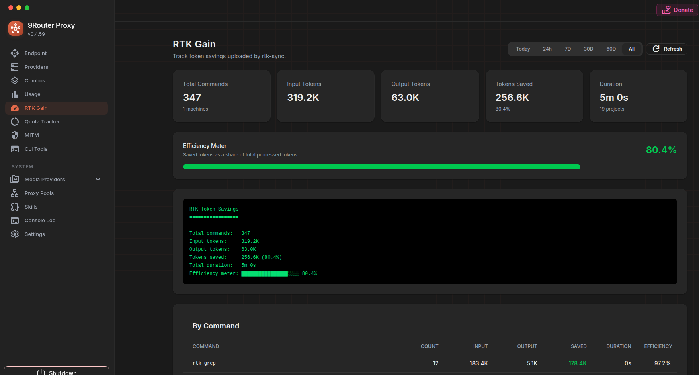

# rtk-sync

## 1. Overview

`rtk-sync` is a lightweight Rust CLI tool that syncs local RTK token usage tracking data from SQLite to a central server.

It is designed for low overhead and safe local operation:

- reads the RTK SQLite database in read-only mode;
- keeps sync checkpoint state outside RTK's database;
- uploads usage events in batches over HTTP(S);
- uses stable idempotency keys for safe retries;
- uses blocking I/O only, with no async runtime.

Current MVP features:

- inspect the local RTK tracking database;
- derive and persist a stable machine ID;
- configure server endpoint and token from CLI;
- sync one batch with `once`;
- install a user service that runs sync in the background after login/restart.

## 2. Quick Start

Install the latest release online:

```bash
curl -fsSL https://raw.githubusercontent.com/vuongtlt13/rtk-sync/master/scripts/install.sh | bash
```

Or install to a custom directory:

```bash
curl -fsSL https://raw.githubusercontent.com/vuongtlt13/rtk-sync/master/scripts/install.sh | bash -s -- --install-dir ~/.local/bin
```

Then verify:

```bash
rtk-sync --version
```

Use the forked 9router Docker image for the sync server until the integration is merged upstream:

```text
vuongtlt13/9router
```



Configure `rtk-sync` to use your 9router endpoint:

```bash
rtk-sync config --endpoint https://your-domain.example/api/rtk/sync --token your_token
```

Check the local RTK tracking database:

```bash
rtk-sync inspect
```

Test local DB reading without a server:

```bash
rtk-sync once --dry-run
```

Run one sync batch:

```bash
rtk-sync once
```

Install auto-start service for background sync:

```bash
rtk-sync install-service
```

The background interval is read from `config.toml` (`interval = 60` by default). See [Installation](docs/installation.md) for per-platform install commands and source-build instructions.

## 3. Configuration

`rtk-sync` auto-creates an OS-specific config file on first run:

```text
macOS:   ~/Library/Application Support/rtk-sync/config.toml
Linux:   ~/.config/rtk-sync/config.toml
Windows: %APPDATA%\rtk-sync\config.toml
```

Configuration precedence:

1. CLI flags
2. environment variables
3. `config.toml`
4. defaults

The RTK database path is auto-detected using the same OS-specific default as RTK:

```text
dirs::data_local_dir()/rtk/history.db
```

You can configure endpoint/token with:

```bash
rtk-sync config --endpoint https://your-server.example.com/api/rtk/events --token your-token
```

If you prefer not to store tokens in `config.toml`, configure a token env var instead:

```bash
rtk-sync config --endpoint https://your-server.example.com/api/rtk/events --token-env RTK_SYNC_TOKEN
export RTK_SYNC_TOKEN="your-token"
```

See [config.example.toml](config.example.toml) and [.env.example](.env.example) for examples.

## 4. References

- [Installation](docs/installation.md)
- [Configuration](docs/configuration.md)
- [Command Reference](docs/commands.md)
- [Server API](docs/server-api.md)
- [Local Development](docs/development.md)
- [Security Notes](docs/security.md)

## License

MIT
